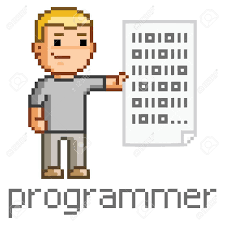

  

<h2>Hi friends.</h2> 

<h3>My name is Andrew B. Schaefer and I am a Back-End leaning, Full-Stack Software Engineer with a passion for progression.</h3> 

<h3>I'm using GitHub not just as a tool to collaberate or for version control, but also as a space to save projects/school assignments of which I am proud. This helps me to track and showcase my progression as I learn new development techniques.
  
<h2>About Me</h2>
  <h4><li>I'm from Orlando, Florida where I work for the mouse.</li></h4>
  <h4><li>I'm currently searching for my first developer role.</li></h4>
  <h4><li>My list of things to learn next includes: Ruby, Mobile Development, and basic neural networks.</h4></li>
  <h4><li>Fun Facts: I have been skateboarding 20+ years and I have flown over 2 million miles</h4></li>
  

<h2>Contact Me</h2>

<h3>If you happen to stumble upon my repositories, I would welcome any advice or enhancements for any of the code you see. Perhaps we will work together in the future, thanks for stopping by.</h3>
